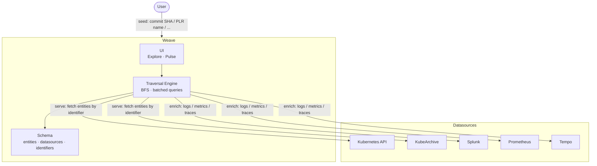
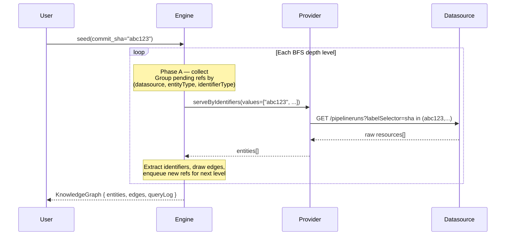
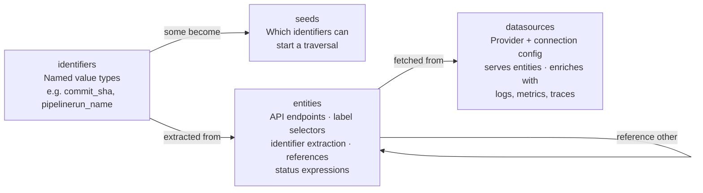

# Weave

A schema-driven knowledge graph engine for CI/CD observability. Define your entities (Tekton PipelineRuns, Pods, custom CRDs, …) and datasources (Kubernetes, Splunk, Prometheus, …) in a YAML schema — Weave traverses their relationships and renders them as an interactive graph.

## Running

```bash
docker compose up -d
```

Open http://localhost:3333.

For local development without Docker:

```bash
npm install
npm run dev
```

---

## How it works

### Architecture



### Traversal flow

Starting from a seed (e.g. a commit SHA), Weave runs a BFS over the entity graph:



One batched query per `(datasource, entityType, identifierType)` group per depth level — not one query per entity.

### Schema-driven design

The engine has no hardcoded knowledge of any entity type. Everything — API endpoints, label selectors, identifier paths, relationships, status expressions — is declared in the schema YAML:



---

## Schema

The schema defines what entities exist, how they relate to each other, and which datasources serve or enrich them.

### Where it lives

```
schemas/
└── konflux.schema.yaml   # your schema — edit this directly, track it in git

.weave/                   # gitignored — runtime state only
└── konflux/
    └── overrides.json    # datasource connection overrides (optional)
```

Edit `schemas/<projectId>.schema.yaml` directly. Weave reads it on every request (mtime-cached), so changes take effect immediately without a restart.

### Structure

```yaml
identifiers:      # named identifier types (commit_sha, pipelinerun_name, ...)
seeds:            # which identifiers can be used as graph entry points
entities:         # entity types with their fields, relationships, and k8s config
datasources:      # connections to external systems (kubernetes, splunk, prometheus, ...)
traversal:        # depth, concurrency, timeouts
```

### Entity definition

Each entity declares:
- **`format`** — `kubernetes_resource` for K8s API resources, `json` for generic REST responses
- **`k8s`** — for Kubernetes resources: the API endpoint pattern and which identifiers map to which label selectors. The provider uses this to construct traversal queries without needing query templates in the YAML.
- **`identifiers`** — JSON paths to extract identifier values from the raw resource
- **`references`** — fields that point to other entities (drives graph edges)
- **`display`** — fields shown in the UI

```yaml
entities:
  PipelineRun:
    format: kubernetes_resource
    k8s:
      endpoint: /apis/tekton.dev/v1/namespaces/{namespace}/pipelineruns
      identifierSelectors:
        commit_sha: pipelinesascode.tekton.dev/sha   # identifier → label key
        snapshot_name: appstudio.openshift.io/snapshot
    identifiers:
      pipelinerun_name:
        path: metadata.name
      commit_sha:
        path: metadata.labels['pipelinesascode.tekton.dev/sha']
    references:
      - field: metadata.name
        points_to: TaskRun
        as: pipelinerun_name
```

### Datasource definition

Each datasource declares:
- **`provider`** — which provider implementation to use (`kubernetes`, `kubearchive`, `splunk`, `prometheus`, `tempo`, `rest`)
- **`serves`** — list of entity type names this datasource can serve via graph traversal. Query logic lives in the provider code; the schema just says which entity types are available.
- **`enriches`** — on-demand queries that add data to a known entity (logs, metrics, traces). Each query has a typed `query:` block.

```yaml
datasources:
  my-kubernetes:
    provider: kubernetes
    connection:
      url: ${KUBERNETES_API_URL}
      auth:
        type: bearer
        token: ${KUBERNETES_TOKEN}
    serves:
      - PipelineRun
      - TaskRun
      - Pod

  my-prometheus:
    provider: prometheus
    connection:
      url: ${PROMETHEUS_URL}
    enriches:
      PipelineRun:
        queries:
          pipeline_duration:
            as: pipeline_duration
            format: metrics
            query:
              type: promql
              promql: tekton_pipelines_controller_pipelinerun_duration_seconds_sum{...}
```

### Environment variables

Connection URLs and credentials in the schema use `${VAR}` substitution. Set these in `.env` (gitignored):

| Variable | Used by |
|----------|---------|
| `KUBERNETES_API_URL` | Kubernetes provider |
| `KUBERNETES_TOKEN` | Kubernetes provider |
| `KUBEARCHIVE_URL` | KubeArchive provider |
| `KUBEARCHIVE_TOKEN` | KubeArchive provider |
| `SPLUNK_URL` | Splunk provider |
| `SPLUNK_USERNAME` | Splunk provider |
| `SPLUNK_PASSWORD` | Splunk provider |
| `PROMETHEUS_URL` | Prometheus provider |

### Datasource connection overrides

`.weave/<projectId>/overrides.json` (gitignored) lets you override the connection URL or auth for a datasource without editing the schema — useful for pointing at a dev endpoint without touching the committed schema:

```json
{
  "my-kubernetes": { "url": "https://api.dev-cluster.example.com:6443" }
}
```

---

## Project setup

Copy `.env.example` to `.env` and configure your datasource connections, then run:

```bash
docker compose up -d
```
